<h1 align="center">Hi 👋, I'm Shivendra Singh</h1>
<h3 align="center">A passionate aspiring Android developer from India.</h3>

  

  

  

<!-- - 🔭 I’m currently working on [Placemantra](https://github.com/shivendra7083/placemantra) -->

- 🌱 I’m currently learning **JAVA**

<!-- - 👯 I’m looking to collaborate on [Shoe Billing Software](https://github.com/shivendra7083/SHOE-SALES-MANAGEMENT-SOFTWARE) -->

<!-- - 🤝 I’m looking for help with [Spotify Clone](https://github.com/shivendra7083/Spotify-Clone) -->

- 👨‍💻 All of my projects are available at [https://github.com/shivendra7083](https://github.com/shivendra7083)

<!-- - 📝 I regularly write articles on [https://github.com/shivendra7083/KernelHookers](https://github.com/shivendra7083/KernelHookers) -->

- 💬 Ask me about **React, JS, Python GUIs**

- 📫 How to reach me **shivendra7083@gmail.com**

- 📄 Know about my experiences [https://www.linkedin.com/in/shivendra-singh-2ba447273/](https://www.linkedin.com/in/shivendra-singh-2ba447273/)

<!-- - ⚡ Fun fact **I eat a lot while coding. 😂** -->

<h3 align="left">Connect with me:</h3>

<!--  -->

<!--  -->

<h3 align="left">Languages and Tools :</h3>

                

<h3 align="left">Support:</h3>

  
&nbsp;

&nbsp;

<!---
shivendra7083/shivendra7083 is a ✨ special ✨ repository because its `README.md` (this file) appears on your GitHub profile.
You can click the Preview link to take a look at your changes.
--->
